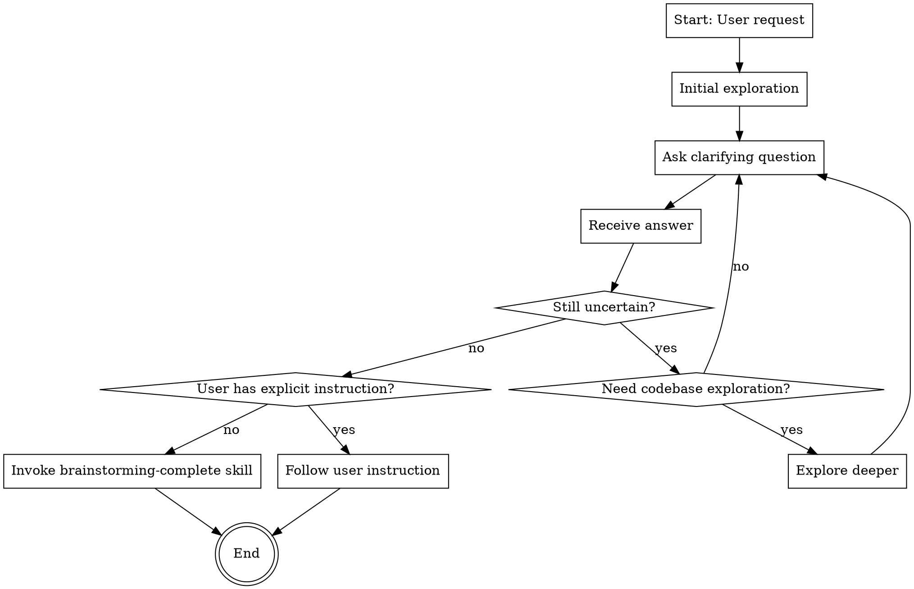

# Exploring and Resolving Uncertainty

## Overview

Help users clarify vague ideas and resolve uncertainties through iterative exploration and targeted questioning. The outcome may be a concrete design ready for implementation, or simply a clearer understanding of the problem space.

**Core principle**: Explore when uncertain, ask to clarify, re-explore if answers reveal new unknowns. Stop when uncertainties are resolved or user is satisfied - this could happen after one round or many rounds. No fixed iteration limits.

**Flexibility**: Brainstorming adapts to the situation. Simple clarifications may complete in one exchange. Complex problems may require many iterations. The process continues as long as genuine uncertainty remains and stops immediately when clarity is achieved.

## When to Use

Use this skill when:
- User requests feature design or architecture planning
- User's request is vague or lacks clear specifications
- User doesn't know exactly what they want
- User explicitly asks to "explore", "brainstorm", or "clarify"

Do NOT use when:
- User provides complete, unambiguous specifications
- User explicitly says "just implement X" with clear requirements
- Task is purely mechanical (refactoring, bug fix with known solution)

## Process Flow

## The Process

### 1. Initial Exploration

Start by understanding the current context:
- Check relevant files, documentation, recent commits
- Identify existing patterns and conventions
- Look for related implementations

**When to explore**: Only if uncertainty exists about technical context. Skip if request is context-independent.

### 2. Ask Clarifying Questions

Ask questions to resolve uncertainties:
- **One question at a time** - avoid overwhelming the user
- **Prefer multiple choice** when possible - easier to answer
- **Open-ended when necessary** - for complex topics
- Focus on: purpose, constraints, success criteria, technical requirements

### 3. Evaluate Uncertainty After Each Answer

After receiving an answer, explicitly assess:
- Are there technical details still unclear?
- Are there architectural choices that need clarification?
- Are there constraints or requirements not yet understood?
- Did the answer reveal new areas of uncertainty?

### 4. Decide Next Action

Based on uncertainty evaluation:

**If uncertainty remains:**
- Need codebase context? → Explore then ask
- Need user clarification? → Ask directly
- Both? → Explore first, then ask informed questions

**If uncertainty resolved:**
- User gave explicit instruction? → Follow it
- User gave no instruction? → Invoke `brainstorming-complete` skill

## Uncertainty Judgment Criteria

Genuine uncertainty exists when:
- Technical implementation approach is unclear
- Multiple valid solutions exist and choice criteria unknown
- Constraints or requirements are ambiguous
- User's actual goal is unclear
- Codebase context needed but missing

NOT genuine uncertainty:
- You can make reasonable assumptions
- Standard practices apply
- User already provided sufficient information
- Further questions would be "nice to have" not "need to have"

## Exploration Judgment Criteria

Explore codebase when:
- Need to understand existing patterns
- Need to check compatibility with existing code
- Need to find related implementations
- User's answer references existing code

Do NOT explore when:
- Request is context-independent
- You already have sufficient context
- Exploration would be speculative (fishing for information)

## Key Principles

### Efficiency Over Thoroughness
- Explore only when genuinely uncertain
- Stop as soon as clarity is achieved
- Don't pursue "complete understanding" - pursue "sufficient understanding"

### Flexibility Over Process
- No fixed iteration limits
- Adapt to task complexity
- One round or hundred rounds - both valid

### User Control
- User can say "enough" anytime
- User explicit instructions override everything
- When user gives direction, follow it immediately

### Intelligent Iteration
- Each exploration should reduce uncertainty
- Each question should target specific unknowns
- If answer reveals new uncertainty, iterate
- If answer resolves uncertainty, move forward

## Common Mistakes

| Mistake | Why It's Wrong | How to Avoid |
|---------|----------------|--------------|
| Exploring without uncertainty | Wastes time, looks aimless | Ask: "What specific uncertainty does this exploration resolve?" |
| Asking questions you can answer | Inefficient, annoying | Only ask what you genuinely don't know |
| Continuing after clarity achieved | Ignores the goal | After each answer, explicitly check: "Is there still uncertainty?" |
| Stopping too early | Incomplete understanding | Don't assume - verify uncertainties are actually resolved |
| Ignoring user's "enough" signal | Disrespects user control | Watch for "that's enough", "just do it", "skip this" |
| Fixed iteration mindset | Inflexible, inappropriate | Remember: 1 round or 100 rounds, both valid |
| Exploring "just in case" | Speculative waste | Explore only for known uncertainties |
| Proposing designs during brainstorming | Wrong phase, premature | Brainstorming is for clarification only, not design |
| Assuming implementation is desired | Presumptuous | Wait for explicit instruction or invoke brainstorming-complete |

## Red Flags - Check Yourself

If you're thinking:
- "Let me explore everything first" → Do you have specific uncertainties?
- "I should ask a few more questions" → What specific uncertainty remains?
- "This might be useful to know" → Is it necessary or just nice-to-have?
- "I'll do one more round" → Why? What uncertainty justifies it?
- "User seems satisfied but..." → User satisfaction = stop signal
- "Let me propose some options" → Are you designing instead of clarifying?
- "I have enough info, I'll implement" → Did user explicitly ask for implementation?

**All of these mean: Stop and evaluate if you're adding value or just following process.**

## When to Stop

Brainstorming ends when:
1. **Uncertainty resolved** - all genuine unknowns are clarified
2. **User says "enough"** - explicit signal to stop
3. **User gives explicit instruction** - "implement it", "let's do X", etc.

After stopping:
- **User gave instruction** → Follow the instruction directly
- **User gave no instruction** → Invoke `brainstorming-complete` skill

## Skill Boundaries

**This skill IS responsible for:**
- Exploring codebase to understand context
- Asking questions to clarify requirements
- Iterating until uncertainties are resolved
- Deciding when to stop

**This skill is NOT responsible for:**
- Proposing designs or solutions
- Creating implementation plans
- Writing documentation
- Making decisions about what to do next (that's `brainstorming-complete`'s job)

**Critical**: Do NOT propose designs, architectures, or solutions during brainstorming. Your job is to clarify and understand, not to design. What happens after brainstorming is determined by `brainstorming-complete` skill or user instruction.

## Anti-Patterns

### ❌ "Let me propose a design now"
**Why bad**: Brainstorming is about clarification, not design. Design decisions belong elsewhere.

**Real example from testing**: Agent proposed 4 cache types (local, distributed, multi-level, CDN) during clarification phase, influencing user's thinking before understanding their actual needs.

### ❌ "I'll explore everything to be thorough"
**Why bad**: Exploration without specific uncertainty is waste. Be targeted.

### ❌ "User seems done but I'll ask one more"
**Why bad**: Ignores user satisfaction signal. Respect user's judgment.

### ❌ "This is simple, I'll skip brainstorming"
**Why bad**: Skill was invoked for a reason. Even simple tasks may have hidden uncertainties.

### ❌ "I have enough info, I'll start implementing"
**Why bad**: Assumes user wants implementation without explicit confirmation.

**Real example from testing**: After clarifying logging requirements (Winston, file output, rotation), agent immediately started implementing without checking if user wanted implementation, advice, or design review.

### ❌ "I stopped at basic questions"
**Why bad**: Vague requests need deep exploration, not surface-level questions.

**Real example from testing**: For "optimize performance", agent asked 3 basic questions but didn't explore project context, git history, or recent work to understand what might need optimization.
