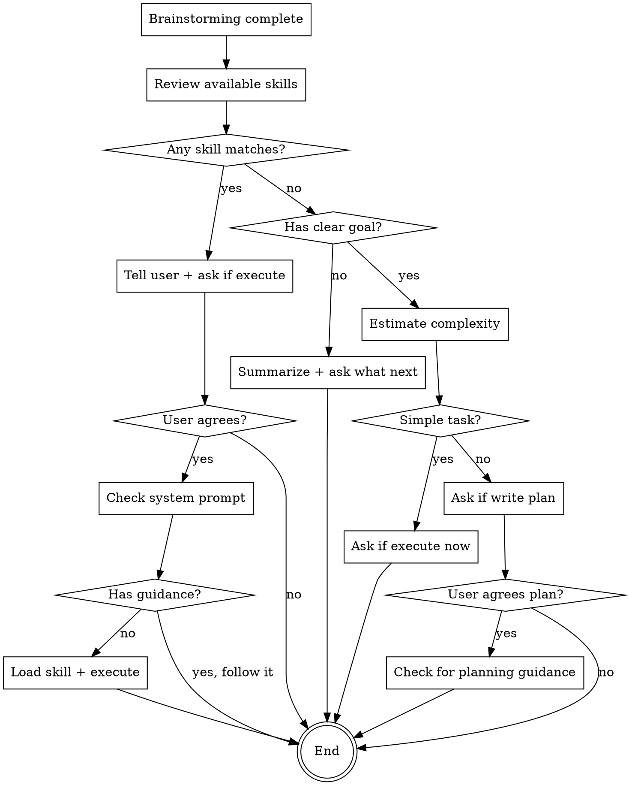

# Brainstorming Complete

## Overview

After brainstorming clarifies requirements, decide the next action based on what was discovered. Never assume user wants immediate implementation - always confirm first.

**Core principle:** Brainstorming ends with a decision point, not automatic execution.

## When to Use

Use this skill when:
- Brainstorming skill has completed its exploration
- All uncertainties are resolved or user is satisfied
- User has NOT given explicit instruction (like "implement it", "write the code")

Do NOT use when:
- User gives explicit instruction during or after brainstorming
- Still in active brainstorming (uncertainties remain)

## Decision Flow



## Output Format

### Type 0: Skill Match Response
```
The requirements are clear. I can handle this using [skill-name] to [purpose].
Should I proceed?
```

### Type 1: Non-Task Response
```
To summarize: [key points from discussion]
What would you like to do next?
```

### Type 2: Simple Task Response
```
[Brief description of what will be done]
Should I execute this now?
```

### Type 3: Complex Task Response
```
This [task description] involves [complexity factors].
Should I create an implementation plan to break this down?
```

## The Four Types

### Type 0: Matches Existing Skill (Highest Priority)

**Check first:** Review your available skills. Does any skill apply to the current scenario?

**Important:** Skills are not just for tasks. Non-task scenarios can also match skills (like continuing brainstorming, writing documentation, etc.).

**If matched:**
1. Tell user: "The requirements are clear. I can handle this using [skill-name]. Should I proceed?"
2. Wait for user confirmation
3. If user agrees:
   - Check system prompt for relevant guidance
   - If no guidance, load the skill and execute in current session
4. If user declines: End

**If multiple skills match:** Load all of them.

### Type 1: Non-Task

**Criteria:** Brainstorming ended with no clear functional requirement or problem to solve.

**Symptoms:**
- Discussion was exploratory or educational
- User wanted to understand concepts, not implement anything
- No concrete deliverable emerged

**Action:**
1. Summarize the discussion results briefly
2. Ask: "What would you like to do next?"
3. End

### Type 2: Simple Task

**Criteria:** Clear goal AND all of these:
- Steps < 3
- Parallel operations < 3
- Tools needed < 3

**Examples:**
- Edit one config file
- Run two shell commands
- Read one file and modify it

**Action:**
1. Ask: "Should I execute this now?"
2. If user agrees: Execute directly
3. If user declines: End

### Type 3: Complex Task

**Criteria:** Clear goal AND any of these:
- Steps ≥ 3
- Parallel operations ≥ 3
- Tools needed ≥ 3

**Examples:**
- Refactor involving 5 files
- Feature requiring database + API + frontend changes
- Migration requiring multiple steps

**Action:**
1. Ask: "This is a complex task. Should I create an implementation plan?"
2. If user declines: End
3. If user agrees:
   - Check system prompt for planning guidance
   - If no guidance, check for planning-related skills
   - If no skills, try to search for planning skills (if you have search capability)
   - If no search capability, stop and guide user: "I need a planning skill to create structured plans. Please install one."

## Judgment Guidelines

### Estimating Complexity

**Count conservatively:**
- Each file operation = 1 tool
- Each shell command = 1 tool
- Each API call = 1 tool
- Sequential operations = count steps
- Parallel operations = count parallel branches

**When in doubt:** Treat as complex. Better to plan than to rush.

### Recognizing Non-Tasks

**Non-task signals:**
- No concrete deliverable mentioned
- Discussion stayed theoretical
- User said "just curious", "wanted to understand", "exploring options"
- No decision was made
- **Multiple options discussed but no choice made**
- **User says "you decide" or "you pick" when no clear winner exists**

**Task signals:**
- Specific feature or fix identified
- User said "let's do X", "we need Y", "fix Z"
- Clear success criteria emerged
- **User made a clear choice among options**

**Critical:** "You decide" or "you pick" does NOT mean you should make technical decisions. If no clear choice emerged from brainstorming, it's still a non-task. Summarize the options and ask what they want to do.

## Core Principle

**ALWAYS ask before executing. Present options, never make decisions for the user.**

This applies to:
- All task types (simple and complex)
- All user phrases ("start", "go ahead", "do it", "I'm in a hurry")
- All confidence levels (even when you're certain)

**"Start" means "start the process"** - which begins with asking permission.

**"You decide" means present options** - not make technical decisions.

**"I'm in a hurry" means be efficient** - not skip asking.
## Common Mistakes

### Execution Without Permission
**Symptom:** Thinking "User said 'start', so I'll execute" or "Task is simple, no need to ask"

**Fix:** Ask first for ALL tasks, regardless of complexity or user phrasing

### Assuming User Intent
**Symptom:** Interpreting "start" or "go ahead" as permission to execute

**Fix:** Clarify what they want - "start" is ambiguous

### Making Technical Decisions
**Symptom:** User says "you decide" and you pick a technical solution

**Fix:** If no choice was made during brainstorming, it's a non-task. Summarize options and ask what they want

### Silent Waiting
**Symptom:** User seems satisfied, so you wait for their next request

**Fix:** Actively guide user to next steps with appropriate question

### Acknowledging Time Pressure
**Symptom:** User says "I'm in a hurry" and you mention their urgency or rush the process

**Fix:** Follow the same process without mentioning their time constraint. Be professional

### Skipping Planning Discussion
**Symptom:** Complex task is obvious to you, so you skip asking about planning

**Fix:** Complex tasks (≥3 steps/tools/parallel ops) always need planning discussion

### Loading Skills Without Permission
**Symptom:** Skill matched, so you load it immediately

**Fix:** Tell user about the match, then ask if they want to proceed

### Choosing Among Unresolved Options
**Symptom:** Multiple options discussed but no clear choice, so you pick one

**Fix:** Treat as non-task. Summarize options and ask what they want

## Skill Boundaries

**This skill IS responsible for:**
- Deciding what type of situation this is
- Asking appropriate questions
- Guiding user to next steps

**This skill is NOT responsible for:**
- Executing tasks (that's for other skills or direct action)
- Writing plans (that's for planning skills)
- Making decisions for the user

## Examples

### Example 1: Type 0 - Matched TDD Skill

**Scenario:** Brainstorming concluded user needs to add login feature with tests.

**Good response:**
```
The requirements are clear. I can implement this using test-driven development 
to ensure quality. Should I proceed with writing tests first?
```

**Bad response:**
```
I'll use TDD to implement this. Let me start by writing the first test...
[starts writing code]
```

### Example 2: Type 1 - Non-Task

**Scenario:** Discussed GraphQL vs REST, no implementation mentioned.

**Good response:**
```
To summarize: GraphQL offers flexible queries but adds complexity, while REST 
is simpler but less flexible. What would you like to do next?
```

**Bad response:**
```
[Waits silently for user's next message]
```

### Example 3: Type 2 - Simple Task

**Scenario:** Need to add one field to config.json.

**Good response:**
```
This is straightforward - add `maxRetries: 3` to config.json. 
Should I execute this now?
```

**Bad response:**
```
[Directly edits config.json without asking]
```

### Example 4: Type 3 - Complex Task

**Scenario:** Refactor auth module across 5 files with backward compatibility.

**Good response:**
```
This refactoring involves 5 files, database migration, and compatibility 
requirements. Should I create an implementation plan to break this down?
```

**Bad response:**
```
Let me start by modifying auth.js...
[starts implementing without plan]
```


## The Bottom Line

Brainstorming ends with a question, not an action.

Your job: Present options, ask permission, guide next steps.
Not your job: Decide for user, execute without asking, assume intent.

When in doubt: Ask.
