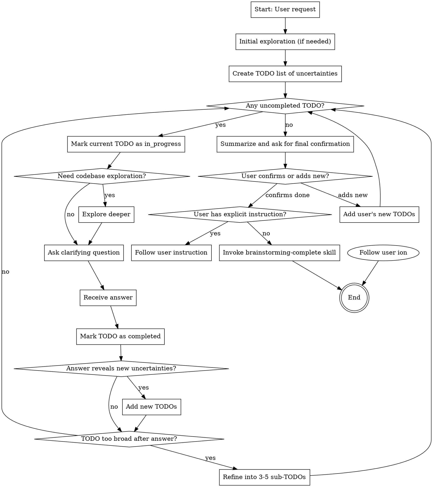

# Exploring and Resolving Uncertainty

## Overview

Help users clarify vague ideas and resolve uncertainties through iterative exploration and targeted questioning, using a TODO list to track all uncertainties explicitly.

**Core principle**: Create TODO list of uncertainties, resolve them one by one, stop when all TODOs completed and user confirms nothing is missed.

**Key innovation**: Replace memory-based tracking with explicit TODO list. This prevents systematic omissions when users mention multiple aspects.

## When to Use

Use this skill when:
- User requests feature design or architecture planning
- User's request is vague or lacks clear specifications
- User doesn't know exactly what they want
- User explicitly asks to "explore", "brainstorm", or "clarify"

Do NOT use when:
- User provides complete, unambiguous specifications
- User explicitly says "just implement X" with clear requirements
- Task is purely mechanical (refactoring, bug fix with known solution)

## Required Tools

This skill requires:
- **TodoWrite** (or equivalent task tracking tool) - MANDATORY for tracking uncertainties
- **Read/Grep tools** - For codebase exploration when needed

Without TodoWrite, this skill cannot function properly. The entire methodology depends on explicit TODO tracking.

## Process Flow



## Output Format

### TODO List Format

Your TODO list should look like this:
```
TodoWrite:
- [ ] Understand caching scope - which endpoints need caching?
- [ ] Clarify performance requirements - what's acceptable latency?
- [ ] Confirm infrastructure constraints - Redis available?
```

### Question Format

**Multiple choice (preferred):**
```
For caching scope, which endpoints need caching?
A) All API endpoints
B) Only product catalog endpoints
C) Only user-facing endpoints
D) Something else (please specify)
```

**Open-ended (when necessary):**
```
What performance requirements do you have for the cached endpoints?
(e.g., target response time, cache hit rate, etc.)
```

### Final Confirmation Format

```
I've covered the following aspects:
- Caching scope: Product catalog endpoints only
- Performance: <200ms response time required
- Infrastructure: Redis available, 2GB memory limit

Is there anything I missed or any other aspect you'd like to clarify?
```

## The Process

### 1. Initial Exploration (If Needed)

**When to explore**: Only if uncertainty exists about technical context. Skip if request is context-independent.

Start by understanding the current context:
- Check relevant files, documentation, recent commits
- Identify existing patterns and conventions
- Look for related implementations

### 2. Create TODO List of Uncertainties

**CRITICAL**: Immediately after understanding user's request, create explicit TODO list using TodoWrite.

**Initial TODO creation:**
- Identify 3-5 coarse-grained uncertainties (unless user explicitly mentions more)
- Sort by importance (foundational questions first)
- Use clear descriptions (flexible format, no strict rules)

**Example:**
```
User: "I want to add caching to my API"

TodoWrite:
- [ ] Understand caching scope - which endpoints?
- [ ] Clarify performance requirements
- [ ] Confirm infrastructure constraints
```

**Why 3-5 TODOs?**
- Avoids overwhelming initial list
- Coarse-grained TODOs will be refined as you learn more
- User may mention more aspects later

**Sorting by importance:**
- Foundational questions first (what/why)
- Dependent questions later (how/where)
- This naturally handles dependencies

### 3. Process Each TODO

**For each uncompleted TODO:**

**Step 1: Mark as in_progress**
```
TodoWrite:
- [x] Understand caching scope - product catalog
- [ ] Clarify performance requirements  ← in_progress
- [ ] Confirm infrastructure constraints
```

**Step 2: Check if codebase exploration needed**
- Need to understand existing patterns? → Explore first
- Can ask directly? → Skip exploration

**Step 3: Ask clarifying question**
- One question at a time
- Prefer multiple choice when possible
- Open-ended when necessary
- Focus on: purpose, constraints, success criteria, technical requirements

### 4. Update TODO List After Each Answer

**After receiving answer:**

**Step 1: Mark current TODO as completed**
```
TodoWrite:
- [x] Understand caching scope - product catalog
- [x] Clarify performance requirements - <200ms response
- [ ] Confirm infrastructure constraints
```

**Step 2: Check if answer reveals new uncertainties**

Ask yourself:
- Did answer mention new requirements?
- Did answer introduce new constraints?
- Did answer reference unfamiliar concepts?
- Did answer raise new questions?

**If yes, add new TODOs immediately:**
```
TodoWrite:
- [x] Understand caching scope - product catalog
- [x] Clarify performance requirements - <200ms response
- [ ] Confirm infrastructure constraints
- [ ] NEW: Understand batch job timing - when does it run?
- [ ] NEW: Clarify invalidation strategy
```

**Step 3: Check if completed TODO was too broad**

**A TODO is too broad if:**
- It cannot be directly converted into a clear question
- It involves multiple aspects or multiple choices
- After getting answer, you realize it needs more detail

**If too broad, refine into 3-5 sub-TODOs:**
```
Before:
- [x] Understand deployment needs

After (refined):
- [x] Understand deployment needs - user chose Docker
- [ ] Understand Docker Compose structure
- [ ] Understand service directory layout
- [ ] Understand network configuration
```

**Refinement limits:**
- Maximum 3-5 sub-TODOs per refinement
- Prevents TODO explosion
- Stop refining when TODO is clear enough to ask directly

**Step 4: Return to check TODO list**

### 5. Final Confirmation (When All TODOs Completed)

**When all TODOs are marked as completed:**

**Step 1: Summarize what you've learned**
- Briefly recap key points from all answers
- Highlight important decisions or constraints
- Keep it concise (3-5 bullet points)

**Step 2: Ask for final confirmation**
```
I've covered the following aspects:
- [Aspect 1]: [Key finding]
- [Aspect 2]: [Key finding]
- [Aspect 3]: [Key finding]

Is there anything I missed or any other aspect you'd like to clarify?
```

**Step 3: Handle user response**
- User says "no" or "that's all" → Proceed to step 6
- User mentions new aspects → Add new TODOs, return to step 3
- User gives explicit instruction → Follow it immediately

**CRITICAL**: This is the last safety check. Don't skip it.

## Examples

### Example 1: Simple Feature Request

**User:** "I want to add caching to my API"

**Agent:**
```
TodoWrite:
- [ ] Understand caching scope - which endpoints?
- [ ] Clarify performance requirements
- [ ] Confirm infrastructure constraints
```

For caching scope, which endpoints need caching?
A) All API endpoints
B) Only product catalog endpoints
C) Only user-facing endpoints
D) Something else

**User:** "B, product catalog only"

**Agent:**
```
TodoWrite:
- [x] Understand caching scope - product catalog endpoints
- [ ] Clarify performance requirements ← in_progress
- [ ] Confirm infrastructure constraints
```

What performance requirements do you have?
(e.g., target response time, cache hit rate)

**User:** "Response time should be under 200ms"

**Agent:**
```
TodoWrite:
- [x] Understand caching scope - product catalog endpoints
- [x] Clarify performance requirements - <200ms response
- [ ] Confirm infrastructure constraints ← in_progress
```

Do you have Redis or another caching system available?

**User:** "Yes, Redis is available"

**Agent:**
```
TodoWrite:
- [x] Understand caching scope - product catalog endpoints
- [x] Clarify performance requirements - <200ms response
- [x] Confirm infrastructure constraints - Redis available
```

I've covered the following aspects:
- Caching scope: Product catalog endpoints only
- Performance: <200ms response time required
- Infrastructure: Redis available

Is there anything I missed or any other aspect you'd like to clarify?

**User:** "No, that's all"

**Agent:** [Invokes brainstorming-complete skill]

### Example 2: Vague Request with Refinement

**User:** "Help me improve the deployment process"

**Agent:**
```
TodoWrite:
- [ ] Understand current deployment pain points
- [ ] Clarify deployment environment
- [ ] Identify improvement goals
```

What specific problems are you experiencing with the current deployment?

**User:** "It's slow and manual, takes 2 hours each time"

**Agent:**
```
TodoWrite:
- [x] Understand current deployment pain points - slow (2h), manual
- [ ] Understand manual steps - what's being done manually?
- [ ] Understand slowness causes - what takes the most time?
- [ ] Clarify deployment environment
- [ ] Identify improvement goals
```

[Note: First TODO was too broad, refined into two specific sub-TODOs]

What manual steps are involved in the deployment?

### Example 3: User Adds New Aspect

**User:** "I want to add authentication"

**Agent:**
```
TodoWrite:
- [ ] Understand authentication type needed
- [ ] Clarify user management requirements
- [ ] Confirm security requirements
```

[After resolving all TODOs...]

I've covered:
- Authentication: JWT-based
- User management: Email/password only
- Security: HTTPS required

Is there anything I missed?

**User:** "Oh, we also need social login with Google"

**Agent:**
```
TodoWrite:
- [x] Understand authentication type - JWT
- [x] Clarify user management - email/password
- [x] Confirm security - HTTPS required
- [ ] Understand Google OAuth requirements ← NEW
```

For Google OAuth integration, do you already have Google Cloud credentials set up?
### 6. Decide Next Action

**After user confirms nothing is missed:**

- User gave explicit instruction? → Follow it
- User gave no instruction? → Invoke `brainstorming-complete` skill

## TODO List Management Rules

### Creation
- **Timing**: Immediately after understanding user's request
- **Quantity**: 3-5 coarse-grained TODOs (unless user explicitly mentions more)
- **Sorting**: By importance (foundational first, dependent later)
- **Description**: Clear and flexible, no strict format required

### States
- `pending` - Not yet started
- `in_progress` - Currently asking about this TODO
- `completed` - Resolved

### Refinement
- **When**: After receiving answer, immediately judge
- **Triggers**:
  - Answer reveals new uncertainties → Add new TODOs
  - TODO too broad (can't ask clear question) → Refine into 3-5 sub-TODOs
- **Stop when**: Description is clear enough to ask directly
- **Limit**: One TODO refines into maximum 3-5 sub-TODOs

### Dynamic Adjustments
- **Add**: User mentions new aspect → Add immediately, sort by importance
- **Delete**: User says "don't need this" → Remove TODO
- **Merge**: Two TODOs are actually same question → Combine them
- **Split**: TODO too broad → Refine into 3-5 sub-TODOs
- **Reorder**: Importance judgment was wrong → Adjust order
- **Reopen**: Completed TODO wasn't fully resolved → Mark as pending again

### Batch Operations
- **One answer, multiple TODOs**: If one answer resolves multiple TODOs, mark all as completed

### Visibility
- **TODO list is visible to user**: Let user understand your thinking and progress

## Exploration Judgment Criteria

Explore codebase when:
- Need to understand existing patterns
- Need to check compatibility with existing code
- Need to find related implementations
- User's answer references existing code

Do NOT explore when:
- Request is context-independent
- You already have sufficient context
- Exploration would be speculative (fishing for information)

## Edge Cases

### User Refuses to Answer

**User:** "I don't want to answer that"

**Response:** "No problem. I'll mark this as a known uncertainty and we can revisit it later if needed. Let me move to the next question."

```
TodoWrite:
- [x] Question X - user prefers not to specify
- [ ] Next question ← in_progress
```

### User Says "I Don't Know"

**User:** "I'm not sure about that"

**Response:** Offer options or context:
```
That's okay. Let me provide some context to help:
- Option A would mean [consequence]
- Option B would mean [consequence]

Would either of these work, or would you like to explore this further?
```

If user still unsure, mark as "to be determined" and continue:
```
TodoWrite:
- [x] Question X - to be determined later
- [ ] Next question ← in_progress
```

### User Gives Contradictory Answers

**Example:** User says "must be fast" but also "don't want caching"

**Response:** Point out the contradiction gently:
```
I notice you mentioned both [requirement A] and [requirement B].
These might be in tension because [explanation].
Which is more important, or is there a way to satisfy both?
```

### User Keeps Adding Requirements

**Pattern:** After final confirmation, user keeps saying "oh, and also..."

**Response:** Add new TODOs and continue the process:
```
TodoWrite:
[...existing completed TODOs...]
- [ ] New requirement 1
- [ ] New requirement 2
```

No problem, let me clarify these additional aspects...

**If excessive (>10 iterations):** Gently suggest documenting requirements:
```
I notice we're covering many aspects. Would it help to create a requirements document
to track everything systematically? I can help with that.
```

### User Gives Vague Answers

**User:** "Make it good" or "Whatever works"

**Response:** Ask for concrete criteria:
```
To help me understand "good", could you share:
- What would success look like?
- What problems are you trying to avoid?
- Are there any examples of "good" you've seen elsewhere?
```
## Key Principles

### TODO List Over Memory
- Don't rely on memory to track uncertainties
- Create explicit TODO list immediately
- Update TODO list after every answer
- Trust the TODO list, not your feeling

### Systematic Coverage
- All user-mentioned aspects must become TODOs
- Check TODO list before concluding
- Final confirmation catches any missed aspects

### Progressive Refinement
- Start with coarse-grained TODOs (3-5)
- Refine as you learn more
- Stop refining when clear enough to ask

### User Control
- User can say "enough" anytime
- User explicit instructions override everything
- When user gives direction, follow it immediately

## Common Mistakes

| Mistake | Why It's Wrong | How to Avoid |
|---------|----------------|--------------|
| Not creating TODO list | Relies on memory, causes omissions | Create TODO list immediately after user request |
| Not updating TODO after each answer | Loses track of new uncertainties | Mark completed + add new TODOs after EVERY answer |
| Thinking "I remember all uncertainties" | Memory fails, especially with complex requests | Trust the TODO list, not your memory |
| Stopping when "feeling done" | Subjective feeling ≠ objective completion | Check TODO list: any uncompleted items? |
| Skipping final confirmation | Misses user's last chance to add aspects | Always ask "anything I missed?" when TODOs done |
| Creating too many initial TODOs | Overwhelming, hard to manage | Start with 3-5 coarse-grained TODOs |
| Over-refining TODOs | TODO explosion, loses focus | Limit refinement to 3-5 sub-TODOs |
| Exploring without uncertainty | Wastes time, looks aimless | Explore only for known uncertainties |
| Proposing designs during brainstorming | Wrong phase, premature | Brainstorming is for clarification only |
| Assuming implementation is desired | Presumptuous | Wait for explicit instruction or invoke brainstorming-complete |

## Red Flags - Check Yourself

If you're thinking:
- "I remember what to ask" → Create TODO list, don't rely on memory
- "I've covered the main points" → Check TODO list, any uncompleted?
- "This feels complete" → Feeling ≠ fact. Check TODO list.
- "I'll remember to ask about that later" → Add to TODO NOW, not later
- "Let me explore everything first" → Do you have specific uncertainties?
- "This might be useful to know" → Is it necessary or just nice-to-have?
- "User seems satisfied but..." → User satisfaction = stop signal
- "Let me propose some options" → Are you designing instead of clarifying?
- "I have enough info, I'll implement" → Did user explicitly ask for implementation?

**All of these mean: Stop and check your TODO list or evaluate if you're adding value.**

## When to Stop

Brainstorming ends when:
1. **All TODOs completed** - no uncompleted items in TODO list
2. **User confirms nothing missed** - after final confirmation question
3. **User says "enough"** - explicit signal to stop anytime
4. **User gives explicit instruction** - "implement it", "let's do X", etc.

After stopping:
- **User gave instruction** → Follow the instruction directly
- **User gave no instruction** → Invoke `brainstorming-complete` skill

## Skill Boundaries

**This skill IS responsible for:**
- Creating and maintaining TODO list of uncertainties
- Exploring codebase to understand context
- Asking questions to clarify requirements
- Iterating until all TODOs completed
- Final confirmation with user
- Deciding when to stop

**This skill is NOT responsible for:**
- Proposing designs or solutions
- Creating implementation plans
- Writing documentation
- Making decisions about what to do next (that's `brainstorming-complete`'s job)

**Critical**: Do NOT propose designs, architectures, or solutions during brainstorming. Your job is to clarify and understand, not to design. What happens after brainstorming is determined by `brainstorming-complete` skill or user instruction.

## Anti-Patterns

### ❌ "I'll keep track mentally"
**Why bad**: Human memory is unreliable, especially with multiple uncertainties.

**Real example from baseline test**: User mentioned "connection info, deployment rules, network config" but agent only asked about connection info because they forgot the other two. Result: 67% of requirements missed.

**Fix**: Create TODO list with all three items immediately. Check off as you go.

### ❌ "I've asked enough questions"
**Why bad**: "Enough" is subjective. TODO list is objective.

**Real example**: Agent asked 11 questions but still missed 2 out of 3 user requirements because there was no checklist to verify against.

**Fix**: Check TODO list. Any uncompleted? If yes, keep asking. If no, do final confirmation.

### ❌ "Let me propose a design now"
**Why bad**: Brainstorming is about clarification, not design. Design decisions belong elsewhere.

**Real example from testing**: Agent proposed 4 cache types (local, distributed, multi-level, CDN) during clarification phase, influencing user's thinking before understanding their actual needs.

**Fix**: Stick to clarifying questions. Save design proposals for after brainstorming.

### ❌ "I have enough info, I'll start implementing"
**Why bad**: Assumes user wants implementation without explicit confirmation.

**Real example from testing**: After clarifying logging requirements (Winston, file output, rotation), agent immediately started implementing without checking if user wanted implementation, advice, or design review.

**Fix**: After all TODOs completed and final confirmation, invoke `brainstorming-complete` to decide next steps.

### ❌ "I stopped at basic questions"
**Why bad**: Vague requests need deep exploration, not surface-level questions.

**Real example from testing**: For "optimize performance", agent asked 3 basic questions but didn't explore project context, git history, or recent work to understand what might need optimization.

**Fix**: Create TODOs for all aspects of the vague request. Explore codebase if needed to inform questions.

### ❌ "This TODO is done, moving on"
**Why bad**: Doesn't check if answer revealed new uncertainties or if TODO was too broad.

**Fix**: After marking TODO completed, always check:
1. Did answer reveal new uncertainties? → Add new TODOs
2. Was this TODO too broad? → Refine into sub-TODOs

## The Bottom Line

**Brainstorming is TODO-driven, not memory-driven.**

Create TODO list immediately. Update after every answer. Check TODO list before concluding. Do final confirmation. Only then stop.

Memory fails. TODO list doesn't.
