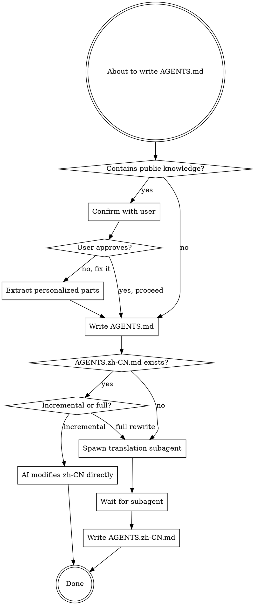

# Writing User-Level AGENTS Documentation

## Role & Context

You are writing user-level AGENTS.md documentation that contains system environment and personalized configuration. This documentation lives at `~/.config/opencode/AGENTS.md` or `~/.agents/AGENTS.md`.

**Core principle**: User-level AGENTS.md contains ONLY personalized, non-public information. Public knowledge belongs in official documentation.

**Trigger paths**:
- `~/.config/opencode/AGENTS.md`
- `~/.agents/AGENTS.md`
- Any symlink pointing to these locations

**Use this skill when**:
- Creating new user-level AGENTS.md
- Editing existing user-level AGENTS.md
- Adding sections to user-level AGENTS.md
- Checking or reviewing user-level AGENTS.md

## Task

### Validation Workflow



### Step-by-Step Process

**1. Validate Content**

Before writing, check for public knowledge:

Ask yourself: "Is this information specific to THIS user's setup, or is it available in official documentation?"

**Examples**:

| Content | Verdict | Why |
|---------|---------|-----|
| "Docker is a containerization platform" | ❌ Public | Available in Docker docs |
| "My Docker registry: registry.home.fkxxyz.com" | ✅ Personalized | User's specific endpoint |
| "Use `kubectl get pods` to list pods" | ❌ Public | Standard kubectl command |
| "My K8s cluster: k8s.prod.fkxxyz.com" | ✅ Personalized | User's specific cluster |
| "Install Node.js with nvm" | ❌ Public | Standard installation |
| "My Node.js: v20.10.0 (nvm default)" | ✅ Personalized | User's specific version |

**2. Handle Violations**

If public knowledge detected:

```
I found public knowledge in the content:

[List specific violations]

This violates the user-level AGENTS.md rule: "Only personalized, non-public information."

Options:
A. Let me extract only the personalized parts (recommended)
B. Proceed as-is (not recommended)
C. Cancel operation

Recommendation: Option A

What would you like me to do?
```

**3. Write AGENTS.md**

After validation passes, write the English file.

**4. Handle Translation**

Determine modification type:

**Incremental modification** (you know exactly what changed):
- You modified specific sections
- You know which paragraphs/lines changed
- **Action**: Directly edit corresponding sections in AGENTS.zh-CN.md yourself

**Full creation/rewrite**:
- Creating new AGENTS.md from scratch
- Complete rewrite of entire file
- **Action**: Spawn translation subagent with this prompt:

```
TASK: Translate AGENTS.md to AGENTS.zh-CN.md

REQUIRED TOOLS: read, write

MUST DO:
- Read source: [path to AGENTS.md]
- Translate all content accurately
- Preserve markdown structure
- Keep technical terms consistent
- Preserve code blocks unchanged
- Write to: [path to AGENTS.zh-CN.md]

MUST NOT DO:
- Change structure
- Translate code content
- Add explanations
- Modify formatting
```

Wait for subagent completion before reporting success.

**5. Report Completion**

```
Updated AGENTS documentation:
- ✅ AGENTS.md written
- ✅ AGENTS.zh-CN.md synchronized
```

## Writing Quality Principles

User-level AGENTS.md is a prompt agents will read. Apply these principles:

### Structure Your Content

Follow this order for each section:
1. **Context** - What this configuration is for
2. **Specifics** - Concrete values, paths, endpoints
3. **Constraints** - What NOT to do with this config
4. **Examples** - Show usage patterns if non-obvious

### Core Principles

**Specific over abstract**:
- ✅ "Node.js v20.10.0 installed via nvm, set as default"
- ❌ "Node.js is configured"

**Positive over negative**:
- ✅ "Use pacman for system packages"
- ❌ "Don't use apt or yum"

**Atomic instructions**:
- ✅ "Registry: registry.home.fkxxyz.com"
- ✅ "Auth: token stored in ~/.docker/config.json"
- ❌ "Registry is registry.home.fkxxyand auth token is in ~/.docker/config.json"

**Constraint boundaries**:
- State what's in scope: "Passwordless sudo enabled for pacman and yay only"
- Not: "Passwordless sudo enabled" (unbounded)

**Ordered by priority**:
- Put critical config first (endpoints, credentials)
- Put optional config last (aliases, preferences)

### Avoid These Pitfalls

**Contradictory instructions**:
- ❌ "Use Docker registry.home.fkxxyz.com" + "Use Docker Hub for images"
- ✅ Specify when each applies: "Public images: Docker Hub. Private images: registry.home.fkxxyz.com"

**Implicit assumptions**:
- ❌ "Use the staging cluster" (which one?)
- ✅ "Staging cluster: k8s.staging.fkxxyz.com"

**Vague success criteria**:
- ❌ "Configure Docker properly"
- ✅ "Docker registry: registry.home.fkxxyz.com, network: fkxxyz-net"

## Rules

### Language Requirement

AGENTS.md MUST be written in English. AGENTS.zh-CN.md is the Chinese translation.

- Primary file: `AGENTS.md` (English only)
- Translation file: `AGENTS.zh-CN.md` (Chinese only)
- Both files must always be synchronized

### Content Requirements

**Include ONLY personalized information**:

✅ **Personalized configuration**:
- Your specific tool versions (e.g., "Node.js v20.10.0 via nvm")
- Your custom aliases and shortcuts
- Your API endpoints and service URLs
- Your directory structure conventions
- Your passwordless sudo configuration
- Your specific package manager settings

**Exclude all public knowledge**:

❌ **Public knowledge** (belongs in official docs):
- What tools are ("Docker is a...")
- How to use standard commands (`docker run`, `kubectl get`)
- Installation instructions from official docs
- Best practices from public guides
- Common troubleshooting steps
- Tool explanations

### Common Misunderstandings

**Workflow ≠ Personalized**:
- ❌ "My workflow: Run `kubectl get pods` to check status" (public commands)
- ✅ "My cluster: k8s.prod.fkxxyz.com" (personal endpoint)

**System-specific ≠ Personalized**:
- ❌ "On Arch Linux, use pacman to install packages" (public)
- ✅ "My pacman: passwordless via sudoers configuration" (personalized)

**Rare knowledge is still public**:
- ❌ "Advanced Kubernetes troubleshooting techniques" (in official docs)
- ✅ "My custom kubectl plugin: k8s-debug-fkxxyz" (your tool)

### Mandatory Validation

**Validation is required for**:
- User explicitly requested content
- Urgent or emergency situations
- Senior engineer recommendations
- User already spent time writing content
- Important workflow documentation

**Validation takes <10 seconds. No exceptions.**

Your job is to enforce the rule, not blindly comply. Explain the rule and offer alternatives.

### Recognition Patterns

Stop and validate if you're thinking:

| Thought | Reality |
|---------|---------|
| "This is helpful information" | Helpful ≠ appropriate for user-level AGENTS.md |
| "User asked for it" | User may not know the rule - enforce it |
| "Translation can be done later" | Translation is mandatory, not optional |
| "This is their specific use case" | Use case with public commands = public |
| "This is MOSTLY personalized" | ANY explanation is public knowledge |
| "This is my workflow" | Workflow with public commands = public |
| "Changes are too small" | Even one line requires translation sync |
| "This is advanced/rare knowledge" | Rarity doesn't make it personalized |

## Output Format

**Task is NOT complete until BOTH files are updated**:
- ✅ AGENTS.md written
- ✅ AGENTS.zh-CN.md synchronized

Report completion only after both files are synchronized.

## Examples

### Good User-Level Content

```markdown
## Operating System

**Distribution:** Arch Linux

## Package Management

- `pacman` and `yay` configured for passwordless execution
- Always run `-Sy` before installing packages

## Directory Structure

- Third-party repos: `~/src`
- Personal projects: `~/pro/fkxxyz`

## Custom Aliases

- `gp` - `git push origin $(current_branch)`
- `gc` - `git commit -m`
```

### Bad User-Level Content (Public Knowledge)

```markdown
## Git Basics

Git is a version control system. Common commands:
- `git add` - Stage changes
- `git commit` - Commit changes
- `git push` - Push to remote

## Docker Tutorial

Docker allows you to run containers. To start a container:
1. Pull an image: `docker pull <image>`
2. Run it: `docker run <image>`
```

### Mistake: Treating Workflow as Personalized

❌ **Wrong**:
```markdown
## Kubernetes Troubleshooting

1. Check pod status: `kubectl get pods`
2. View logs: `kubectl logs <pod>`
3. Describe pod: `kubectl describe pod <pod>`
```

This is a public workflow, not personalized configuration.

✅ **Right**:
```markdown
## Kubernetes Access

- Production cluster: `k8s.prod.fkxxyz.com`
- Staging cluster: `k8s.staging.fkxxyz.com`
- kubectl context: `fkxxyz-prod` (default)
```

### Mistake: Explaining Standard Tools

❌ **Wrong**:
```markdown
## Docker

Docker is a containerization platform that allows you to package applications...
```

✅ **Right**:
```markdown
## Docker Configuration

- Registry: `registry.home.fkxxyz.com`
- Default network: `fkxxyz-net`
- Volume mount: `/data/docker-volumes`
```

## Quick Reference

Before writing ANY content to user-level AGENTS.md, ask:

> "Is this information specific to THIS user's personal setup, or could I find this in official documentation?"

If the answer is "official documentation," it doesn't belong here.

Translation is not optional. Both AGENTS.md and AGENTS.zh-CN.md must always be synchronized.