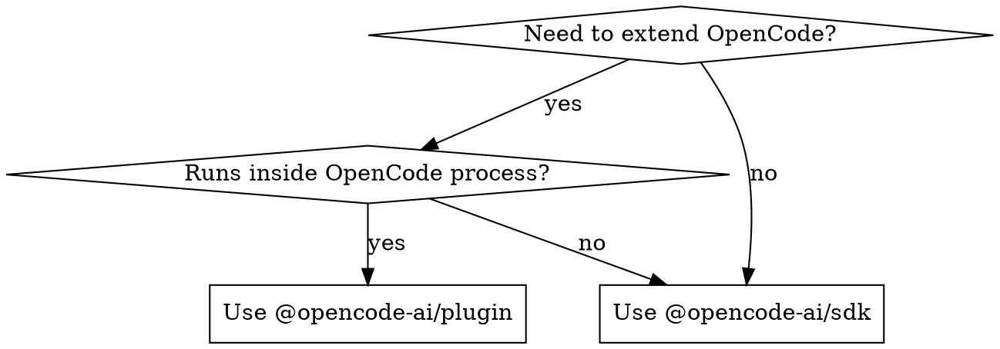

# OpenCode Plugin Development

## Role & Context

You are developing an OpenCode plugin using `@opencode-ai/plugin`. Plugins run inside the OpenCode process and extend its capabilities by adding custom tools, hooking lifecycle events, and modifying behavior.

**Core principle**: A plugin is an async function that receives context and returns hooks.

## Quick Start

Minimal working plugin:

```typescript
import { Plugin, tool } from "@opencode-ai/plugin";

export const MyPlugin: Plugin = async (ctx) => {
  return {
    tool: {
      hello: tool({
        description: "Say hello",
        args: {
          name: tool.schema.string().describe("Name to greet"),
        },
        async execute(args, context) {
          return `Hello, ${args.name}!`;
        },
      }),
    },
  };
};
```

Place in `.opencode/plugin/my-plugin.ts` — OpenCode auto-discovers it.

## Task
When working with OpenCode plugins:

1. **Identify the need**: Determine if you need a plugin (extends OpenCode) vs SDK (automates OpenCode externally)
2. **Choose registration method**: Local `.opencode/plugin/` (development) vs npm package (distribution)
3. **Define tools**: Create functions the AI can call during sessions
4. **Add hooks**: Intercept lifecycle events to modify behavior
5. **Test locally**: Place in `.opencode/plugin/` and verify OpenCode loads it

## Constraints**Do NOT:**
- Use `@opencode-ai/sdk` for plugins (SDK is for external HTTP clients, not in-process plugins)
- Write MCP servers (different protocol entirely)
- Modify OpenCode core source code
- Use `process.cwd()` for file paths (use `context.directory` or `context.worktree`)
- Return non-string from tool `execute` (must always return `string`)
- Place plugins outside `.opencode/plugin/` or `.opencode/plugins/` for auto-discovery
- Mutate `input` in hooks (modify `output` only; `input` is read-only)
- Forget `async` on Plugin function

**Common mistakes:

| Mistake | Correct |
| ------- | ------- |
| Forgetting `async` on Plugin function | `export const P: Plugin = async (ctx) => { ... }` |
| Returning non-string from tool execute | `execute` must always return `string` |
| Using `process.cwd()` for file paths | Use `context.directory` or `context.worktree` |
| Confusing Plugin with SDK | Plugin runs inside OpenCode; SDK is external HTTP client |
| Not handling errors in execute | Throw or return error string; unhandled errors crash the tool call |

## Output Format

When creating a plugin, produce:

1. **Plugin file** (`.ts` or `.js`) with:
   - Default or named export of `Plugin` function
   - Async function signature: `async (ctx) => { ... }`
   - Return object with tools and/or hooks

2. **Tool definitions** with:
   - Clear `description` (shown to AI)
   - Typed `args` using `tool.schema` (Zod)
   - `execute` function returning `string`

3. **Hook implementations** (optional) modifying `output` parameter

## Plugin vs SDK Decision


| Aspect | `@opencode-ai/plugin` | `@opencode-ai/sdk` |
| ------ | --------------------- | ------------------ |
| Runs | Inside OpenCode process | External process |
| Communication | Direct function calls | HTTP/SSE/WebSocket |
| Can add tools | Yes (AI can call them) | No |
| Can hook events | Yes (lifecycle hooks) | No |
| Can modify behavior | Yes (params, headers, env) | No |
| Use case | Extend OpenCode | Automate OpenCode |
## Plugin Structure

```typescript
import { Plugin, tool } from "@opencode-ai/plugin";

export const MyPlugin: Plugin = async (ctx) => {
  // ctx: PluginInput
  return {
    // Hooks object
  };
};
```

## PluginInput (ctx)

```typescript
type PluginInput = {
  client: OpencodeClient; // SDK client (internal, no network)
  project: Project; // Current project info
  directory: string; // Project directory
  worktree: string; // Git worktree root
  serverUrl: URL; // Server URL
  $: BunShell; // Bun shell for running commands
};
```

## Defining Tools

Tools are functions the AI agent can call during a session.

```typescript
import { tool } from "@opencode-ai/plugin";

tool({
  description: "What this tool does (shown to AI)",
  args: {
    name: tool.schema.string().describe("Parameter description"),
    count: tool.schema.number().optional().describe("Optional param"),
    tags: tool.schema.array(tool.schema.string()).describe("Array param"),
    mode: tool.schema.enum(["fast", "slow"]).default("fast"),
  },
  async execute(args, context) {
    // args: validated parameters (Zod-inferred types)
    // context: ToolContext (see below)
    // Must return a string
    return `Result: ${args.name}`;
  },
});
```

### ToolContext

```typescript
type ToolContext = {
  sessionID: string;
  messageID: string;
  agent: string;
  directory: string; // Prefer over process.cwd()
  worktree: string; // For stable relative paths
  abort: AbortSignal; // Cancellation signal
  metadata(input: {
    // Set tool metadata
    title?: string;
    metadata?: Record<string, any>;
  }): void;
  ask(input: {
    // Request permission
    permission: string;
    patterns: string[];
    always: string[];
    metadata: Record<string, any>;
  }): Promise<void>;
};
```

## Available Hooks

### Chat Hooks

```typescript
// Called when a new message is received
"chat.message"?: (
  input: { sessionID: string; agent?: string; model?: { providerID: string; modelID: string }; messageID?: string; variant?: string },
  output: { message: UserMessage; parts: Part[] },
) => Promise<void>

// Modify LLM parameters (temperature, topP, topK)
"chat.params"?: (
  input: { sessionID: string; agent: string; model: Model; provider: ProviderContext; message: UserMessage },
  output: { temperature: number; topP: number; topK: number; options: Record<string, any> },
) => Promise<void>

// Modify request headers sent to LLM provider
"chat.headers"?: (
  input: { sessionID: string; agent: string; model: Model; provider: ProviderContext; message: UserMessage },
  output: { headers: Record<string, string> },
) => Promise<void>
```

### Tool Hooks

```typescript
// Modify tool arguments before execution
"tool.execute.before"?: (
  input: { tool: string; sessionID: string; callID: string },
  output: { args: any },
) => Promise<void>

// Process tool results after execution
"tool.execute.after"?: (
  input: { tool: string; sessionID: string; callID: string; args: any },
  output: { title: string; output: string; metadata: any },
) => Promise<void>

// Modify tool definitions (description and parameters) sent to LLM
"tool.definition"?: (
  input: { toolID: string },
  output: { description: string; parameters: any },
) => Promise<void>
```

### Other Hooks

```typescript
// Global event listener
event?: (input: { event: Event }) => Promise<void>

// Config change listener
config?: (input: Config) => Promise<void>

// Permission request interceptor
"permission.ask"?: (
  input: Permission,
  output: { status: "ask" | "deny" | "allow" },
) => Promise<void>

// Command execution interceptor
"command.execute.before"?: (
  input: { command: string; sessionID: string; arguments: string },
  output: { parts: Part[] },
) => Promise<void>

// Shell environment variable injection
"shell.env"?: (
  input: { cwd: string; sessionID?: string; callID?: string },
  output: { env: Record<string, string> },
) => Promise<void>
```

### Experimental Hooks

```typescript
// Transform messages before sending to LLM
"experimental.chat.messages.transform"?: (
  input: {},
  output: { messages: { info: Message; parts: Part[] }[] },
) => Promise<void>

// Transform system prompt
"experimental.chat.system.transform"?: (
  input: { sessionID?: string; model: Model },
  output: { system: string[] },
) => Promise<void>

// Customize session compaction prompt
"experimental.session.compacting"?: (
  input: { sessionID: string },
  output: { context: string[]; prompt?: string },
) => Promise<void>

// Post-process completed text
"experimental.text.complete"?: (
  input: { sessionID: string; messageID: string; partID: string },
  output: { text: string },
) => Promise<void>
```

## Registration Methods

### Method 1: Local Plugin (`.opencode/` directory)

Place plugin files in `.opencode/plugin/` or `.opencode/plugins/`:

```
project/
└── .opencode/
    └── plugin/
        └── my-plugin.ts    # Auto-discovered
```

OpenCode scans `{plugin,plugins}/*.{ts,js}` in `.opencode/` directories. The plugin file must export a `Plugin` function (named or default export).

OpenCode auto-generates `package.json` with `@opencode-ai/plugin` dependency and runs `bun install` in the `.opencode/` directory.

### Method 2: npm Package

```json
// opencode.json or opencode.jsonc
{
  "plugin": ["my-opencode-plugin@1.0.0", "@scope/opencode-plugin@latest"]
}
```

OpenCode resolves the package via `bun install` and imports it. The package must export a `Plugin` function.

### Method 3: File URL

```json
{
  "plugin": ["file:///absolute/path/to/plugin.ts"]
}
```

## Config Precedence for Plugins

Plugin arrays from multiple config sources are concatenated (not replaced):

1. Remote `.well-known/opencode` (org defaults)
2. Global config (`~/.config/opencode/opencode.json`)
3. Custom config (`OPENCODE_CONFIG`)
4. Project config (`opencode.json`)
5. `.opencode/` directories (auto-discovered local plugins)
6. Inline config (`OPENCODE_CONFIG_CONTENT`)

## Complete Working Example

```typescript
import { Plugin, tool } from "@opencode-ai/plugin";

export const MyPlugin: Plugin = async (ctx) => {
  return {
    tool: {
      search_docs: tool({
        description: "Search project documentation",
        args: {
          query: tool.schema.string().describe("Search query"),
          limit: tool.schema.number().optional().describe("Max results"),
        },
        async execute(args, context) {
          const result =
            await ctx.$`grep -r ${args.query} ${context.directory}/docs --include="*.md" -l`
              .quiet()
              .nothrow()
              .text();
          const files = result.trim().split("\n").filter(Boolean);
          if (!files.length) return "No documentation found.";
          const limited = files.slice(0, args.limit ?? 10);
          return `Found ${files.length} files:\n${limited.join("\n")}`;
        },
      }),
    },

    "chat.params": async (_input, output) => {
      output.temperature = 0.5;
    },

    "shell.env": async (_input, output) => {
      output.env.PROJECT_ROOT = ctx.directory;
    },

    "permission.ask": async (input, output) => {
      if (input.permission === "read") {
        output.status = "allow";
      }
    },
  };
};
```

---

## Reference

### Plugin Structure

```typescript
import { Plugin, tool } from "@opencode-ai/plugin";

export const MyPlugin: Plugin = async (ctx) => {
  // ctx: PluginInput
  return {
    // Hooks object
  };
};
```

### PluginInput (ctx)

```typescript
type PluginInput = {
  client: OpencodeClient; // SDK client (internal, no network)
  project: Project; // Current project info
  directory: string; // Project directory
  worktree: string; // Git worktree root
  serverUrl: URL; // Server URL
  $: BunShell; // Bun shell for running commands
};
```

### Defining Tools

Tools are functions the AI agent can call during a session.

```typescript
import { tool } from "@opencode-ai/plugin";

tool({
  description: "What this tool does (shown to AI)",
  args: {
    name: tool.schema.string().describe("Parameter description"),
    count: tool.schema.number().optional().describe("Optional param"),
    tags: tool.schema.array(tool.schema.string()).describe("Array param"),
    mode: tool.schema.enum(["fast", "slow"]).default("fast"),
  },
  async execute(args, context) {
    // args: validated parameters (Zod-inferred types)
    // context: ToolContext (see below)
    // Must return a string
    return `Result: ${args.name}`;
  },
});
```

### ToolContext

```typescript
type ToolContext = {
  sessionID: string;
  messageID: string;
  agent: string;
  directory: string; // Prefer over process.cwd()
  worktree: string; // For stable relative paths
  abort: AbortSignal; // Cancellation signal
  metadata(input: {
    title?: string;
    metadata?: Record<string, any>;
  }): void;
  ask(input: {
    permission: string;
    patterns: string[];
    always: string[];
    metadata: Record<string, any>;
  }): Promise<void>;
};
```

### Available Hooks

#### Chat Hooks

```typescript
// Called when a new message is received
"chat.message"?: (
  input: { sessionID: string; agent?: string; model?: { providerID: string; modelID: string }; messageID?: string; variant?: string },
  output: { message: UserMessage; parts: Part[] },
) => Promise<void>

// Modify LLM parameters (temperature, topP, topK)
"chat.params"?: (
  input: { sessionID: string; agent: string; model: Model; provider: ProviderContext; message: UserMessage },
  output: { temperature: number; topP: number; topK: number; options: Record<string, any> },
) => Promise<void>

// Modify request headers sent to LLM provider
"chat.headers"?: (
  input: { sessionID: string; agent: string; model: Model; provider: ProviderContext; message: UserMessage },
  output: { headers: Record<string, string> },
) => Promise<void>
```

#### Tool Hooks

```typescript
// Modify tool arguments before execution
"tool.execute.before"?: (
  input: { tool: string; sessionID: string; callID: string },
  output: { args: any },
) => Promise<void>

// Process tool results after execution
"tool.execute.after"?: (
  input: { tool: string; sessionID: string; callID: string; args: any },
  output: { title: string; output: string; metadata: any },
) => Promise<void>

// Modify tool definitions (description and parameters) sent to LLM
"tool.definition"?: (
  input: { toolID: string },
  output: { description: string; parameters: any },
) => Promise<void>
```

#### Other Hooks

```typescript
// Global event listener
event?: (input: { event: Event }) => Promise<void>

// Config change listener
config?: (input: Config) => Promise<void>

// Permission request interceptor
"permission.ask"?: (
  input: Permission,
  output: { status: "ask" | "deny" | "allow" },
) => Promise<void>

// Command execution interceptor
"command.execute.before"?: (
  input: { command: string; sessionID: string; arguments: string },
  output: { parts: Part[] },
) => Promise<void>

// Shell environment variable injection
"shell.env"?: (
  input: { cwd: string; sessionID?: string; callID?: string },
  output: { env: Record<string, string> },
) => Promise<void>
```

#### Experimental Hooks

```typescript
// Transform messages before sending to LLM
"experimental.chat.messages.transform"?: (
  input: {},
  output: { messages: { info: Message; parts: Part[] }[] },
) => Promise<void>

// Transform system prompt
"experimental.chat.system.transform"?: (
  input: { sessionID?: string; model: Model },
  output: { system: string[] },
) => Promise<void>

// Customize session compaction prompt
"experimental.session.compacting"?: (
  input: { sessionID: string },
  output: { context: string[]; prompt?: string },
) => Promise<void>

// Post-process completed text
"experimental.text.complete"?: (
  input: { sessionID: string; messageID: string; partID: string },
  output: { text: string },
) => Promise<void>
```

### Registration Methods

#### Method 1: Local Plugin (`.opencode/` directory)

Place plugin files in `.opencode/plugin/` or `.opencode/plugins/`:

```
project/
└── .opencode/
    └── plugin/
        └── my-plugin.ts    # Auto-discovered
```

OpenCode scans `{plugin,plugins}/*.{ts,js}` in `.opencode/` directories. The plugin file must export a `Plugin` function (named or default export).

OpenCode auto-generates `package.json` with `@opencode-ai/plugin` dependency and runs `bun install` in the `.opencode/` directory.

#### Method 2: npm Package

```json
// opencode.json or opencode.jsonc
{
  "plugin": ["my-opencode-plugin@1.0.0", "@scope/opencode-plugin@latest"]
}
```

OpenCode resolves the package via `bun install` and imports it. The package must export a `Plugin` function.

#### Method 3: File URL

```json
{
  "plugin": ["file:///absolute/path/to/plugin.ts"]
}
```

### Config Precedence for Plugins

Plugin arrays from multiple config sources are concatenated (not replaced):

1. Remote `.well-known/opencode` (org defaults)
2. Global config (`~/.config/opencode/opencode.json`)
3. Custom config (`OPENCODE_CONFIG`)
4. Project config (`opencode.json`)
5. `.opencode/` directories (auto-discovered local plugins)
6. Inline config (`OPENCODE_CONFIG_CONTENT`)
