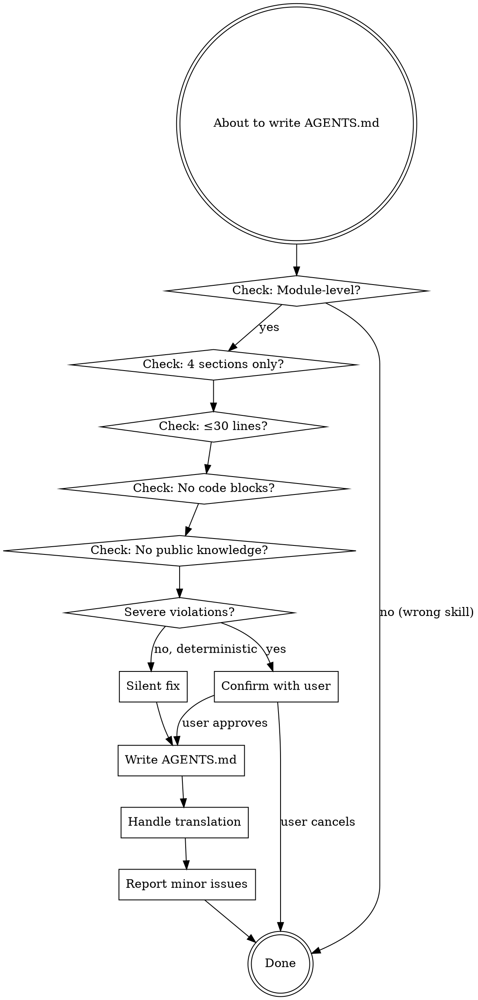

# Writing Module-Level AGENTS Documentation

## Overview

Module-level AGENTS.md files are 30-second orientation guides. They answer "What is this module?" in the time it takes to scan 15-20 lines. Not tutorials. Not API references. Not comprehensive guides.

**Core principle**: If a developer can't understand the module's purpose in 30 seconds, the documentation has failed.

## When to Use This Skill

**Trigger immediately when:**
- Creating new `AGENTS.md` in any project subdirectory
- Editing existing `AGENTS.md` in module directories
- User requests "document the X module"
- You're about to write documentation for a code module
- File path matches `<project_root>/**/AGENTS.md` (but NOT `<project_root>/AGENTS.md` itself)
- Checking or reviewing module-level AGENTS.md

**Symptoms that require this skill:**
- Documentation exceeding 30 lines
- Code blocks in AGENTS.md
- Sections beyond the standard 4 (What/Core/Usage/Pitfalls)
- Explanations of common knowledge or public concepts
- Algorithm details or implementation specifics

## The Iron Law

**Module-level AGENTS.md = 4 sections, ≤30 lines, 30-second reading time.**

No exceptions. Not for "complex modules". Not for "critical modules". Not because "the user asked for detail".

## Language Requirement

**AGENTS.md MUST be written in English.** AGENTS.zh-CN.md is the Chinese translation.

This is non-negotiable. The English version is the source of truth. All translations derive from it.

## Required Structure

```markdown
# module/path AGENTS Guide

## What this module does
[1 sentence describing purpose]

## Core responsibilities
[1 short line per responsibility - OPTIONAL]

## Minimal usage
[1 short line showing most common case - OPTIONAL]

## Common pitfalls
[1 short line per non-obvious trap - OPTIONAL]
```

**That's it. Nothing else.**

## Validation Workflow



### Severe Violations (Confirm Before Writing)

**Confirm with user if ANY of these:**

1. **Length >60 lines** (2x+ over target) for simple modules
2. **Missing "What this module does"** section
3. **Wrong section order** (Pitfalls before What, etc.)
4. **Large code blocks** (>5 lines of code)
5. **Public knowledge** (explaining JSON, HTTP, common patterns)
6. **Extra sections** beyond the standard 4

**Confirmation format:**
```
I found [N] severe issues in the AGENTS documentation:

1. [Issue description]
2. [Issue description]

Options:
A. Let me fix these issues first, then write (Recommended)
B. Write as-is (not recommended - violates 30-second rule)
C. Cancel operation

What would you like me to do?
```

### Deterministic Issues (Silent Fix)

**Fix automatically without asking:**

1. **Missing AGENTS.zh-CN.md** → Create translation via subagent
2. **Translation misalignment** → Update translation via subagent
3. **Minor formatting errors** → Fix silently

### Minor Issues (Suggest After Writing)

**Report as suggestions, not blockers:**

1. **Length 31-60 lines** (not 2x+ over)
2. **Could be more concise**
3. **Minor structure improvements**

**Suggestion format:**
```
Documentation written successfully.

Suggestions for improvement:
- Current length is 45 lines (target: ≤30). Consider condensing.
- "Core responsibilities" section could be more concise.
```

## Translation Handling

### Incremental Modification

When you modify part of existing AGENTS.md:
1. You know what you changed
2. Directly modify corresponding section in AGENTS.zh-CN.md
3. No subagent needed

### Full Creation/Rewrite

When you create new AGENTS.md or completely rewrite:
1. Write complete AGENTS.md
2. Spawn translation subagent:

```
TASK: Translate AGENTS documentation from English to Chinese

EXPECTED OUTCOME: Complete AGENTS.zh-CN.md file with accurate technical term translations

REQUIRED TOOLS: read, write

MUST DO:
- Translate all content accurately
- Preserve markdown structure exactly
- Keep technical terms consistent (reference other AGENTS.zh-CN.md files in project)
- Maintain same section headings and order
- Preserve code blocks unchanged (if any exist despite rules)

MUST NOT DO:
- Change structure or add/remove sections
- Translate code content
- Add explanations or commentary
- Modify formatting

CONTEXT:
Source file: [path to AGENTS.md]
Target file: [path to AGENTS.zh-CN.md]
Reference translations: [list 2-3 other AGENTS.zh-CN.md files for term consistency]
```

3. Wait for subagent completion
4. Verify translation exists

## Rationalization Table

**Every excuse below is WRONG. Here's why:**

| Rationalization | Reality | Counter |
|---|---|---|
| "User explicitly asked for detail" | AGENTS.md has fixed format | User requests don't override documentation standards. Offer to create detailed docs in `docs/` instead. |
| "Complex modules need detailed docs" | Complexity → code comments, not AGENTS | Complexodules need CLEARER docs, not LONGER docs. Complexity is why the 30-second rule matters MORE. |
| "This will help beginners" | AGENTS is for orientation, not tutorials | Tutorials go in `docs/`, AGENTS is 30-second orientation. Beginners need clarity, not volume. |
| "Just adding info, not rewriting" | Updates are refactoring opportunities | Every edit is a chance to improve the whole doc. If adding makes it >30 lines, condense something else. |
| "Matching existing style" | Existing doc may violate rules | Fix violations, don't perpetuate them. Existing verbosity is a bug, not a feature. |
| "Better comprehensive than incomplete" | Comprehensive = overwhelming | Complete ≠ comprehensive. Be complete AND concise. Overwhelming docs are worse than incomplete ones. |
| "Critical module justifies more detail" | Criticality → better docs, not longer | Critical modules need BETTER documentation (clearer, more precise), not MORE documentation. |
| "I'll just add this one example" | Examples accumulate | One example becomes three. Use text descriptions, not code blocks. |
| "The module is genuinely complex" | Complexity is irrelevant | The 30-second rule applies to ALL modules. Complex modules need simpler explanations, not detailed ones. |
| "Time pressure, need to be thorough" | Thoroughness ≠ length | Thorough means covering essentials, not everything. Time pressure demands brevity, not verbosity. |

## Red Flags - STOP and Check

**If you're thinking ANY of these, you're rationalizing:**

- "This module is different because..."
- "Just this once, I'll add..."
- "The user specifically asked for..."
- "It's only a few more lines..."
- "Complex modules deserve..."
- "This will help..."
- "Better safe than sorry..."
- "I'm being thorough..."
- "Matching the existing..."
- "Just one code example..."

**All of these mean: STOP. Re-read this skill. Follow the 4-section structure.**

## What Goes Where

### ✅ In AGENTS.md (Module-Level)

- **What**: 1-sentence purpose
- **Core**: High-level responsibilities (not methods)
- **Usage**: Text description of most common case
- **Pitfalls**: Non-obvious traps only

### ❌ NOT in AGENTS.md

- Full API documentation → Code comments/docstrings
- Method-by-method behavior → Code comments
- Configuration options → Code docs or `docs/`
- Usage examples with code → `docs/examples/`
- Algorithm explanations → Code comments
- Implementation details → Code
- Public knowledge → Nowhere (it's public)
- "How it works" sections → Code comments
- "When to use" sections → Code comments
- Best practices → `docs/`
- Troubleshooting guides → `docs/`

## Length Estimation

**30-second rule = ~100 words = 15-20 lines**

Quick check:
- Count lines (excluding blank lines and heading)
- If >30 lines → Too long
- If >60 lines → SEVERELY too long (2x+ over)

**Adjust for module complexity:**
- Simple wrapper → 10-15 lines
- Standard module → 15-20 lines
- Complex module → 20-30 lines (MAX)

**Never exceed 30 lines.** If you think you need more, you're including content that belongs elsewhere.

## Common Mistakes

| Mistake | Why It's Wrong | Fix |
|---|---|---|
| Adding code blocks | AGENTS is text-only orientation | Describe usage in text: "Call get_block() with platform and symbol" |
| Explaining algorithms | Belongs in code comments | State what it does, not how: "Detects wave patterns using multiple algorithms" |
| Multiple examples | One is too many | Single text description of most common case |
| "When to use" sections | Not part of 4-section structure | Implied by "What this module does" |
| Configuration reference | Belongs in code docs | Mention existence only: "Configurable via config.yml" |
| Error tables | Exhaustive lists belong in docs | Non-obvious pitfalls only |
| Public knowledge | Wastes space | Assume developer knowledge |

## Handling Updates

**When updating existing AGENTS.md:**

1. **Read entire file first**
2. **Check if it violates rules** (length, structure, content)
3. **If adding content would exceed 30 lines:**
   - Condense existing content first
   - Then add new content
   - Final result must be ≤30 lines
4. **Don't match verbose style** - fix it instead
5. **Update translation incrementally** - you know what changed

**Anti-pattern**: "I'll just add the new info and let the user decide about the rest"
**Correct**: "I'll add the new info AND condense the existing content to stay under 30 lines"

## Examples

### ❌ BAD (Violates Rules)

```markdown
# data/cache Module

## What this module does
Provides thread-safe cache management with TTL-based expiration, LRU eviction, and optional Redis persistence.

## Overview
The `data/cache` module implements a thread-safe `CacheManager` class...

## When to Use
Use when implementing caching layers requiring:
- TTL-based expiration
- LRU eviction
...

## How to Use
1. Instantiate the cache:
   ```js
   const cache = new CacheManager({...});
   ```
...
```

**Problems**: 73 lines, code blocks, extra sections (Overview, When to Use, How to Use)

### ✅ GOOD (Follows Rules)

```markdown
# data/cache AGENTS Guide

## What this module does
Thread-safe cache with TTL expiration, LRU eviction, and optional Redis persistence.

## Core responsibilities
Manages cache entries with automatic expiration and eviction policies.

## Minimal usage
Instantiate CacheManager, call get/set/delete methods with keys and values.

## Common pitfalls
Redis persistence requires explicit configuration. TTL defaults to no expiration if not set.
```

**Why it works**: 13 lines, no code, 4 sections only, scannable in 20 seconds

## The Bottom Line

**Module-level AGENTS.md is NOT:**
- A tutorial
- An API reference
- A comprehensive guide
- A place for code examples
- A place for public knowledge

**Module-level AGENTS.md IS:**
- A 30-second orientation
- 4 sections maximum
- ≤30 lines total
- Text-only (no code blocks)
- Scannable at a glance

**If you're unsure, err on the side of LESS content, not more.**

Developers who need details will read the code. AGENTS.md exists to tell them if they're in the right place.
