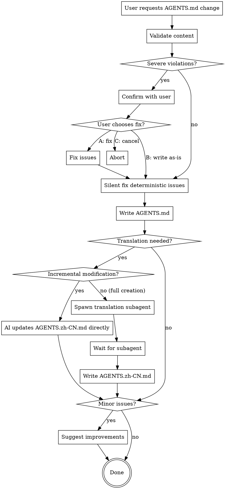

# Writing Project-Root AGENTS Documentation

## Overview

Project-root AGENTS.md is a complete development guide for the entire project. It must include essential information for developers to understand the project, its architecture, and development conventions.

**Core Principle**: Comprehensive but concise. Include what developers need; exclude public knowledge.

## When to Use This Skill

**Trigger**: Any operation that creates or modifies `<project_root>/AGENTS.md` (exact path match, not subdirectories).

**Use this skill when**:
- Creating new project-root AGENTS.md
- Adding/removing sections
- Updating existing content
- User requests changes to project documentation
- Checking or reviewing project-root AGENTS.md

**Do NOT use for**:
- Module-level AGENTS.md (use writing-agents-module-level)
- User-level ~/.config/opencode/AGENTS.md (use writing-agents-user-level)
- README.md or other documentation files

## Workflow



## Required Structure

**CRITICAL: AGENTS.md MUST be written in English.** AGENTS.zh-CN.md is the Chinese translation. Never write AGENTS.md in Chinese or any other language.

### Mandatory Section

**"What This Project Does"** (REQUIRED):
- 1-2 sentences or 1-2 paragraphs
- Describes project purpose clearly
- Must be first section after title

### Common Sections (Flexible Template)

The following sections are common but not all required. Include based on project needs:

```markdown
# Project Name - Project Guidelines

## What This Project Does
[REQUIRED: 1-2 sentences/paragraphs describing purpose]

## Architecture
**Tech Stack**: [Most projects need this]
**Core Components**: [Most projects need this]
**Data Flow**: [Optional - only if unique/important]

## Project Structure
[Root-level directory tree with brief descriptions]
[Details go to module-level AGENTS.md]
[Exception: Highlight uniquely important modules]

## Development Rules
[Optional - only if project has unique conventions]
[But formatting tools are usually required:]
### Before Every Commit
```bash
# Format commands here (must be fast <1s)
```

## Common Pitfalls
[Optional - only non-obvious traps, not routine errors]

## Performance Targets
[Optional - only if performance is critical]

## Security Considerations
[Optional - only if security is critical and has special requirements]

## Multi-language Consistency
[Optional - only if project has i18n needs]
[Describe README/user docs, NOT AGENTS.md rules]

## Documentation
[Optional - but usually needed for large projects with many sub-docs]

## Deployment
[Optional - but usually needed unless project doesn't deploy]
```

## Validation Rules

### Severe Violations (Confirm Before Writing)

These require user confirmation with options A/B/C:

1. **Missing "What This Project Does"**
   - This section is REQUIRED
   - Cannot proceed without it

2. **Contains Public Knowledge**
   - Git basics, standard workflows, common practices
   - AGENTS.md is for project-specific information only
   - Examples of public knowledge:
     - "Git is a version control system..."
     - "To commit: git add, git commit, git push"
     - "Follow PEP 8 for Python" (unless project has specific deviations)
     - "Use semantic versioning" (unless project has unique versioning)

3. **Wrong Section Order**
   - "What This Project Does" must be first
   - Other sections should follow logical flow

4. **Excessively Verbose** (2x+ over reasonable length)
   - Project-root can be longer than module-level
   - But still aim for scannability
   - If sections exceed ~50 lines each, likely too verbose

**Confirmation Format**:
```
I found [N] severe issue(s) in the AGENTS documentation:

1. [Issue description]
2. [Issue description]

Options:
A. Let me fix these issues first, then write
B. Write as-is (not recommended)
C. Cancel operation

Recommendation: Option A
```

### Deterministic Issues (Silent Fix)

Fix these automatically without asking:

1. **Missing AGENTS.zh-CN.md**
   - Always create translation
   - Use subagent for full translation

2. **Translation Incomplete/Misaligned**
   - Update missing sections
   - Preserve existing translations where possible

3. **Obvious Formatting Errors**
   - Missing markdown syntax
   - Broken links
   - Inconsistent heading levels

### Minor Issues (Suggest After Write)

Report these as suggestions, don't block:

1. **Slightly Verbose** (not 2x+ over)
   - Sections could be more concise
   - Suggest specific improvements

2. **Could Be More Scannable**
   - Long paragraphs (>5 lines)
   - Missing bullet points where appropriate

3. **Minor Structure Improvements**
   - Better heading names
   - Reordering for clarity

**Suggestion Format**:
```
Documentation written successfully.

Suggestions for improvement:
- [Suggestion 1]
- [Suggestion 2]
```

## Translation Workflow

### Decision Tree

**Incremental Modification** (AI knows what changed):
1. AI modifies specific section in AGENTS.md
2. AI directly updates corresponding section in AGENTS.zh-CN.md
3. No subagent needed

**Full Creation/Rewrite**:
1. AI writes complete AGENTS.md
2. Spawn translation subagent
3. Wait for completion
4. Write AGENTS.zh-CN.md

### Translation Subagent Prompt

```
TASK: Translate project-root AGENTS documentation from English to Chinese

EXPECTED OUTCOME: Complete AGENTS.zh-CN.md file with accurate technical term translations

REQUIRED TOOLS: read, write

MUST DO:
- Read source AGENTS.md file
- Translate all content accurately
- Preserve markdown structure exactly (headings, lists, code blocks)
- Keep technical terms consistent with project conventions
- Maintain same section headings and order
- Preserve code blocks and bash commands unchanged
- Reference other AGENTS.zh-CN.md files in project for term consistency

MUST NOT DO:
- Change structure or add/remove sections
- Translate code content or bash commands
- Add explanations or commentary
- Modify formatting or indentation
- Translate project-specific names (keep as-is)

CONTEXT:
Source file: [path to AGENTS.md]
Target file: [path to AGENTS.zh-CN.md]
Project: [project name]

TRANSLATION GUIDELINES:
- "Tech Stack" → "技术栈"
- "Core Components" → "核心组件"
- "Data Flow" → "数据流"
- "Development Rules" → "开发规则"
- "Common Pitfalls" → "常见陷阱"
- "Performance Targets" → "性能目标"
- "Security Considerations" → "安全考虑"
- "Deployment" → "部署"

Check existing AGENTS.zh-CN.md files in this project for additional term conventions.
```

## Common Rationalizations (STOP These)

| Rationalization | Reality |
|---|---|
| "User knows their project best" | User may not know documentation rules; validate anyway |
| "I'll handle translation separately" | Translation must be synchronous with content changes |
| "Rules are guidelines" | Required sections and public knowledge rules are strict |
| "User is in a hurry" | Validation prevents bigger problems; takes <30 seconds |
| "This is different because..." | Special cases are rare; follow rules first, ask if truly unique |
| "Architecture explains what it does" | "What This Project Does" is REQUIRED regardless |
| "User only asked for X" | Implicit requirements (translation, validation) still apply |
| "Project-root can be longer" | True, but doesn't mean verbose; aim for conciseness |
| "More documentation is better" | Wrong. Relevant documentation is better. Exclude public knowledge. |

## Red Flags - You're Rationalizing

If you think any of these, STOP and validate:

- "I'll just write what the user asked for"
- "Translation can wait"
- "This section seems optional"
- "The user provided this content, so it must be right"
- "I don't want to slow them down with questions"
- "Rules don't apply to this special case"
- "I'll skip validation this time"

**All of these mean: Validate first. Follow the workflow.**

## Quick Reference

| Situation | Action |
|---|---|
| Creating new AGENTS.md | Validate structure → Write → Spawn translation subagent → Wait |
| Adding new section | Validate necessity → Write to both EN and ZH (incremental) |
| Updating existing section | Modify EN → Modify corresponding ZH section (incremental) |
| Missing "What This Project Does" | Severe violation → Confirm with user |
| Contains public knowledge | Severe violation → Confirm with user |
| Missing AGENTS.zh-CN.md | Deterministic issue → Silent fix via subagent |
| Slightly verbose | Minor issue → Suggest after write |
| User in a hurry | Still validate; speed is not an excuse to skip rules |

## Examples

### Good: Concise Project Overview

```markdown
## What This Project Does

A quantitative trading research and backtesting framework combining Python orchestration, native C/C++ acceleration, and web-based analysis UI for strategy research on historical market data.
```

**Why Good**: One sentence, clear purpose, key technologies mentioned.

### Bad: Verbose and Redundant

```markdown
## What This Project Does

This project is a comprehensive quantitative trading system. It is designed for researchers and traders who want to backtest their strategies. The system uses Python for high-level orchestration because Python is easy to use and has many libraries. It also uses C/C++ for performance-critical parts because C/C++ is fast. There is a web UI for visualization because web UIs are convenient and accessible from anywhere.
```

**Why Bad**: Explains WHY choices were made (obvious), uses 5 sentences instead of 1, includes justifications that belong in architecture docs.

### Good: Project-Specific Rules

```markdown
## Development Rules

### Before Every Commit
```bash
python -m black {source_file_or_directory}  # Python formatting
npx prettier --write .                       # Frontend formatting
```

### Custom Assert Usage
Always use `assert` from `cdef/debug.h`, never `<cassert>`. Our assert converts to compiler hints in Release mode.
```

**Why Good**: Specific to this project, actionable, explains unique conventions.

### Bad: Public Knowledge

```markdown
## Development Rules

### Git Workflow
1. Create a branch for your feature
2. Make commits with clear messages
3. Push to remote
4. Create pull request
5. Wait for review

This is standard Git workflow used across all projects.
```

**Why Bad**: This is public knowledge. Every developer knows basic Git workflow. AGENTS.md should only document project-specific deviations or tools.

## Testing Your Understanding

Before writing AGENTS.md, ask yourself:

1. Does it include "What This Project Does"? (REQUIRED)
2. Does it contain any public knowledge? (FORBIDDEN)
3. Is each section necessary for THIS project? (Not just "nice to have")
4. Will I update AGENTS.zh-CN.md? (REQUIRED)
5. Am I validating before writing? (REQUIRED)

If you answered "no" or "maybe" to any of these, STOP and review this skill.

## Success Criteria

You've successfully used this skill when:

- [ ] "What This Project Does" section exists
- [ ] No public knowledge in any section
- [ ] All sections are project-specific
- [ ] AGENTS.zh-CN.md is synchronized (incremental or full)
- [ ] Severe violations were caught and confirmed
- [ ] Deterministic issues were fixed silently
- [ ] Minor issues were suggested (not blocked)
- [ ] User received clear, actionable feedback
