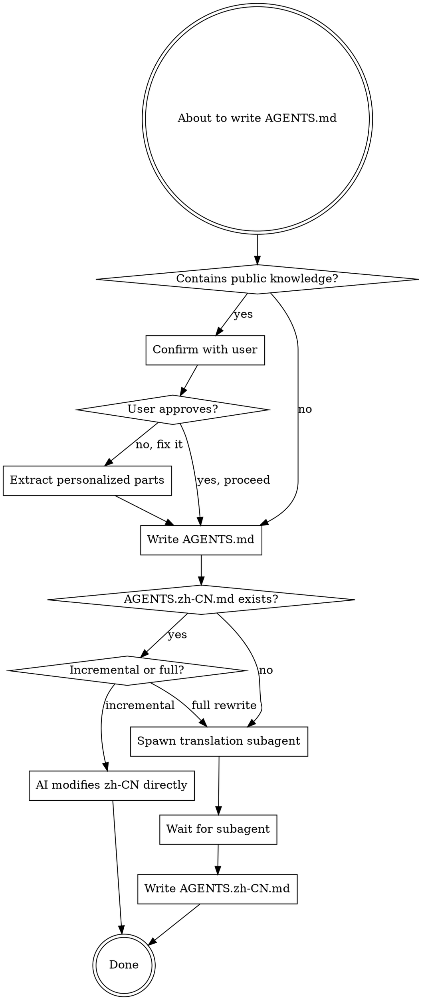

# Writing User-Level AGENTS Documentation

## Overview

User-level AGENTS.md documents system environment and personalized configuration. This skill enforces the "personalized only, no public knowledge" rule and mandatory EN ↔ ZH-CN translation synchronization.

## When to Use

**Trigger paths**:
- `~/.config/opencode/AGENTS.md`
- `~/.agents/AGENTS.md`
- Any symlink pointing to these locations

**Use this skill BEFORE**:
- Creating new user-level AGENTS.md
- Editing existing user-level AGENTS.md
- Adding sections to user-level AGENTS.md
- Checking or reviewing user-level AGENTS.md

## Language Requirement

**AGENTS.md MUST be written in English. AGENTS.zh-CN.md is the Chinese translation.**

This is non-negotiable:
- Primary file: `AGENTS.md` (English only)
- Translation file: `AGENTS.zh-CN.md` (Chinese only)
- Both files must always be synchronized

## The Iron Rule

**User-level AGENTS.md contains ONLY personalized, non-public information.**

Public knowledge belongs in official documentation, not in your personal AGENTS.md.

## What Belongs Here

✅ **Personalized configuration**:
- Your specific tool versions (e.g., "Node.js v20.10.0 via nvm")
- Your custom aliases and shortcuts
- Your API endpoints and service URLs
- Your directory structure conventions
- Your passwordless sudo configuration
- Your specific package manager settings

❌ **Public knowledge** (belongs in official docs):
- What Docker is
- How to use standard commands (`docker run`, `kubectl get`)
- Installation instructions from official docs
- Best practices from public guides
- Common troubleshooting steps
- Tool explanations

## Zero Tolerance Policy

**No explanations, no exceptions, no "just a little context".**

If you find yourself writing:
 "X is a..."
 "X allows you to..."
 "X is used for..."
 "Brief explanation: ..."

**STOP.** That's public knowledge.

**Workflow ≠ Personalized**:
 ❌ "My workflow: Run `kubectl get pods` to check status" (public commands)
 ✅ "My cluster: k8s.prod.fkxxyz.com" (personal endpoint)

**System-specific ≠ Personalized**:
 ❌ "On Arch Linux, use pacman to install packages" (public)
 ✅ "My pacman: passwordless via sudoers configuration" (personalized)

**Rare knowledge is still public**:
 ❌ "Advanced Kubernetes troubleshooting techniques" (in official docs)
 ✅ "My custom kubectl plugin: k8s-debug-fkxxyz" (your tool)

## Validation Workflow



## Task Completion Criteria

**The task is NOT complete until BOTH files are updated:**
- ✅ AGENTS.md written
- ✅ AGENTS.zh-CN.md synchronized

"I'll do translation later" = task incomplete.
"Changes too small for translation" = wrong, update both.
"Translation is a separate task" = wrong, it's part of THIS task.

## Step-by-Step Process

### 1. Validate Content

Before writing, check for public knowledge:

**Ask yourself**: "Is this information specific to THIS user's setup, or is it available in official documentation?"

**Examples**:

| Content | Verdict | Why |
|---------|---------|-----|
| "Docker is a containerization platform" | ❌ Public | Available in Docker docs |
| "My Docker registry: registry.home.fkxxyz.com" | ✅ Personalized | User's specific endpoint |
| "Use `kubectl get pods` to list pods" | ❌ Public | Standard kubectl command |
| "My K8s cluster: k8s.prod.fkxxyz.com" | ✅ Personalized | User's specific cluster |
| "Install Node.js with nvm" | ❌ Public | Standard installation |
| "My Node.js: v20.10.0 (nvm default)" | ✅ Personalized | User's specific version |

### 2. Handle Violations

**If public knowledge detected**:

```
I found public knowledge in the content:

[List specific violations]

This violates the user-level AGENTS.md rule: "Only personalized, non-public information."

Options:
A. Let me extract only the personalized parts (recommended)
B. Proceed as-is (not recommended)
C. Cancel operation

Recommendation: Option A

What would you like me to do?
```

### 3. Write AGENTS.md

After validation passes, write the English file.

### 4. Handle Translation

**Determine modification type**:

**Incremental modification** (you know exactly what changed):
- You modified specific sections
- You know which paragraphs/lines changed
- **Action**: Directly edit corresponding sections in AGENTS.zh-CN.md yourself

**Full creation/rewrite**:
- Creating new AGENTS.md from scratch
- Complete rewrite of entire file
- **Action**: Spawn translation subagent

**Translation subagent prompt**:

```
TASK: Translate user-level AGENTS documentation from English to Chinese

EXPECTED OUTCOME: Complete AGENTS.zh-CN.md file with accurate translations

REQUIRED TOOLS: read, write

MUST DO:
- Read source file: [path to AGENTS.md]
- Translate all content accurately
- Preserve markdown structure exactly
- Keep technical terms consistent
- Maintain same section headings and order
- Preserve code blocks and commands unchanged
- Write to: [path to AGENTS.zh-CN.md]

MUST NOT DO:
- Change structure or add/remove sections
- Translate code content or commands
- Add explanations or commentary
- Modify formatting

CONTEXT:
This is user-level AGENTS documentation containing personalized system configuration.
Source: [path]
Target: [path with .zh-CN.md extension]
```

**Wait for subagent completion** before reporting success.

### 5. Report Completion

```
Updated AGENTS documentation:
- ✅ AGENTS.md written
- ✅ AGENTS.zh-CN.md synchronized
```

## Red Flags - STOP and Validate

These thoughts mean you're about to violate the rule:

| Thought | Reality |
|---------|---------|
| "This is helpful information" | Helpful ≠ appropriate for user-level AGENTS.md |
| "User asked for it" | User may not know the rule - your job to enforce it |
| "This is important for their workflow" | Importance doesn't override the personalized-only rule |
| "Translation can be done later" | Translation is mandatory, not optional |
| "User only mentioned English file" | Both files always updated together |
| "This is their specific use case" | Use case ≠ personalized. "How to use kubectl" is public even if it's their workflow |
| "This is MOSTLY personalized with just a little explanation" | Zero tolerance - ANY explanation is public knowledge |
| "This is my workflow, not public knowledge" | Workflow with public commands = public. Only endpoints/settings are personalized |
| "The changes are too small to warrant translation" | Size doesn't matter - even one line requires translation sync |
| "This is system-specific, not public" | System-specific ≠ personalized. "How to use X on Y" is public |
| "This is advanced/rare knowledge" | Rarity doesn't make it personalized. If it's in docs, it's public |
| "Existing AGENTS.md has violations, so this is consistent" | Fix existing violations, don't add more |

## No Exceptions
**These are NOT valid reasons to skip validation:**
❌ "User explicitly requested this content"
 Your job is to enforce the rule, not blindly comply
 Explain the rule and offer alternatives
❌ "This is urgent/emergency"
 Validation takes <10 seconds
 Urgency never overrides rules
❌ "Senior engineer recommended it"
 Authority doesn't override technical rules
 The rule exists for good reasons
❌ "User already spent time writing this"
 Sunk cost fallacy
 Better to fix now than maintain wrong content forever
❌ "This is important for their workflow"
 Importance doesn't override the personalized-only rule
 Suggest proper location (project docs, wiki, etc.)
## Common Mistakes

### Mistake 1: Treating Workflow as Personalized

❌ **Wrong**:
```markdown
## Kubernetes Troubleshooting

1. Check pod status: `kubectl get pods`
2. View logs: `kubectl logs <pod>`
3. Describe pod: `kubectl describe pod <pod>`
```

This is a public workflow, not personalized configuration.

✅ **Right**:
```markdown
## Kubernetes Access

- Production cluster: `k8s.prod.fkxxyz.com`
- Staging cluster: `k8s.staging.fkxxyz.com`
- kubectl context: `fkxxyz-prod` (default)
```

### Mistake 2: Forgetting Translation

❌ **Wrong**: Update AGENTS.md only

✅ **Right**: Always update both AGENTS.md and AGENTS.zh-CN.md

### Mistake 3: Explaining Standard Tools

❌ **Wrong**:
```markdown
## Docker

Docker is a containerization platform that allows you to package applications...
```

✅ **Right**:
```markdown
## Docker Configuration

- Registry: `registry.home.fkxxyz.com`
- Default network: `fkxxyz-net`
- Volume mount: `/data/docker-volumes`
```

## Examples

### Good User-Level Content

```markdown
## Operating System

**Distribution:** Arch Linux

## Package Management

- `pacman` and `yay` configured for passwordless execution
- Always run `-Sy` before installing packages

## Directory Structure

- Third-party repos: `~/src`
- Personal projects: `~/pro/fkxxyz`

## Custom Aliases

- `gp` - `git push origin $(current_branch)`
- `gc` - `git commit -m`
```

### Bad User-Level Content (Public Knowledge)

```markdown
## Git Basics

Git is a version control system. Common commands:
- `git add` - Stage changes
- `git commit` - Commit changes
- `git push` - Push to remote

## Docker Tutorial

Docker allows you to run containers. To start a container:
1. Pull an image: `docker pull <image>`
2. Run it: `docker run <image>`
```

## The Bottom Line

**Before writing ANY content to user-level AGENTS.md, ask**:

> "Is this information specific to THIS user's personal setup, or could I find this in official documentation?"

If the answer is "official documentation," it doesn't belong here.

**Translation is not optional**. Both AGENTS.md and AGENTS.zh-CN.md must always be synchronized.